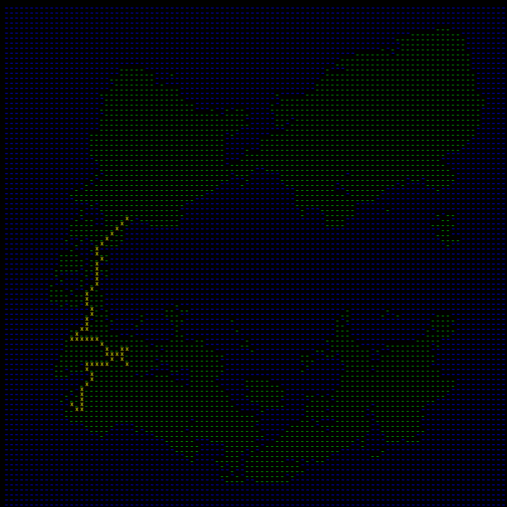

# AsciiWorldGeneration
A Python implementation to randomly generate worlds much like Dwarf Fortress.

##Land
###Algorithm
The algorithm to generate landmass is similar to a disease spreading algorithm.
The first step is to place a center randomly on the map with a specified score (currently).

The algorithm then iterates on the squares around the center. This next iteration will assign scores to these squares.
The adjacent squares will either inherit the score from the center, or it will possibly inherit the (score - 1). Whether is inherits the score or the (score - 1) is determined based on a hard-coded (currently) probability.
The code currently produces something like the following:
###Examples

##Rivers
###Algorithm
First the algorithm finds a random point of land closest to the ocean.
After finding this point it finds an end point, which currently is simply another point
closest to the ocean on the same island. Then it will run A* to find the path from
one point to the next one.

Then, it takes this path generated and runs a Midpoint Displacement algorithm to
introduce some randomness.
###Examples

