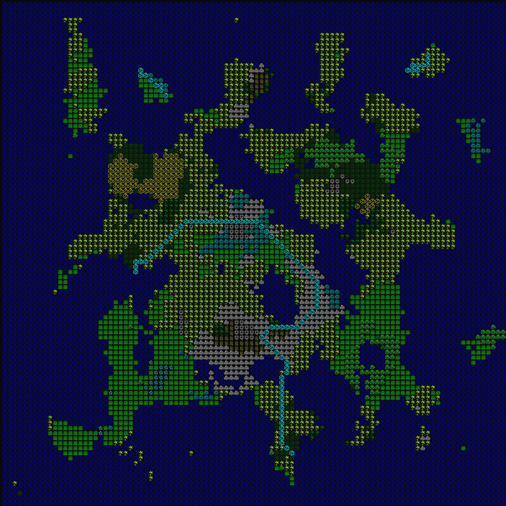
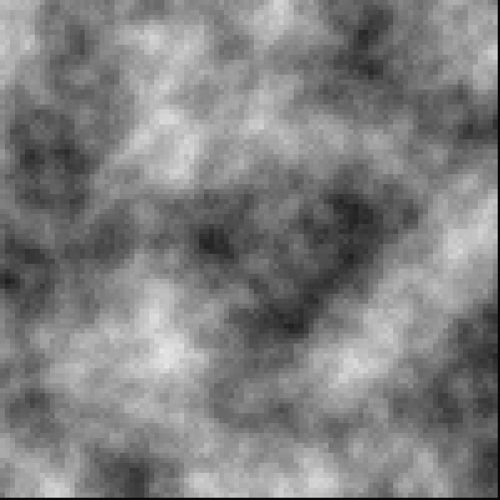
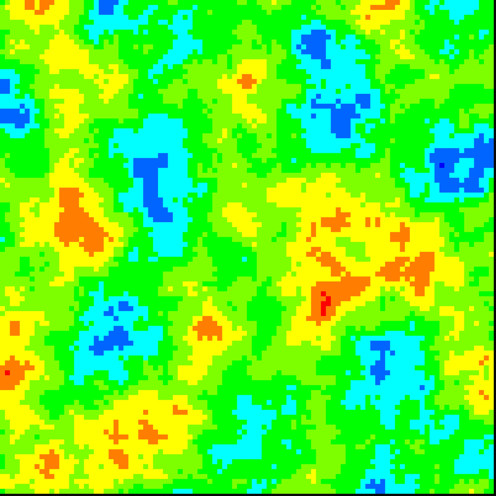

# AsciiWorldGeneration
A Python implementation to randomly generate worlds much like Dwarf Fortress.

##Land
###Algorithm
The algorithm used is to leverage a perlin noise function. The code takes a point and plugs it into the Perlin Noise function.
Then the code scores the point based on the distance from each edge, and the output of the noise function.
The further from an edge and the larger the value of the noise function output will yield a land point.
If the score falls below a certain acceptance criteria it will be rejected and kept as ocean.

The code currently produces something like the following:
###Examples

##Rivers
###Algorithm
First the algorithm finds a random point of land closest to the ocean.
After finding this point it finds an end point, which currently is simply another point
closest to the ocean on the same island. Then it will run A* to find the path from
one point to the next one.

Then, it takes this path generated and runs a Midpoint Displacement algorithm to
introduce some randomness.

Currently this is having some issues so the displacement algorithm is disabled.

##Biomes
###Algorithm
The idea for biomes is to use moisture and height to determine the Biome to use.
In the future this will utilize the temperature as well. Temperature being colder in the north and south, and warmer in the middle.

###Height Map
The height map utilizes the previously run noise algorithm. Therefore, mountains will more likely appear in the center of the map.
This will most likely change in the future and utilize its own noise algorithm.

The height map is as follows for this example:

###Moisture Map
The moisture map uses a new noise function and generates a new map at random.

The moisture map is as follows for this example:

